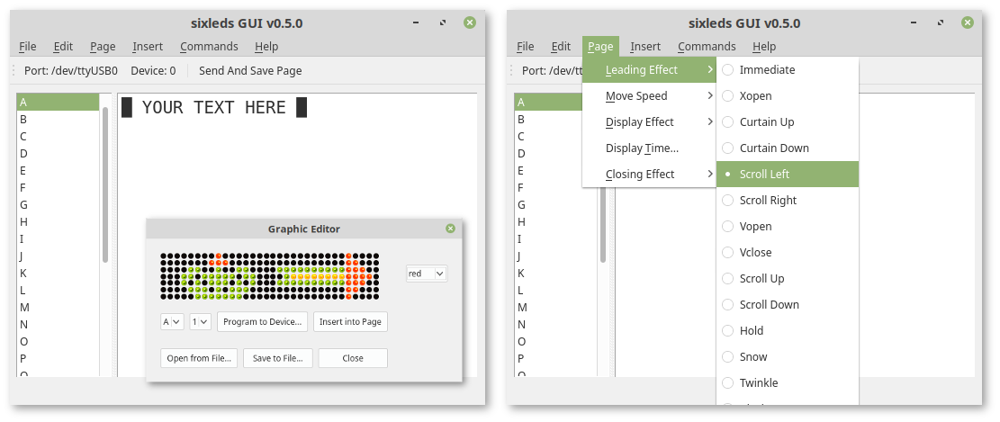

# sixleds
**LED Display Control Library, Command Line Utility and Graphical User Interface (GUI)**


## Compatibility
This library was made for providing Linux support for the following devices:
- Maplin N00GA - using the AM004-03128/03127 LED Display communication board
- it also works with the Velleman MML16CN, MML16R, MML24CN
- McCrypt LED Light Writing 590996 (the Conrad Laufschrift)

## Installation
The installer expects that `python3` and `pip3` is installed on your system and will install the python package and a link for the GUI in your start menu.
```
# download and go to package dir
cd sixleds

# open install.sh in terminal and enter your sudo password when prompted
./install.sh

# to uninstall use
./install.sh --uninstall
```

## Functionality
- The sixleds object will hold an array of display lines and pages, and an array of Schedules which can be pushed to the device.
- Each line setup by the display can have multiple pages controlled by the sixleds.updateline Function.
- Each active schedule will used the cycle the display on each line.
- An on disk backup will be loaded at creation and stored after every change.
- Uploading custom graphics to the device is supported. Graphics are saved in simple text files where each char represents one pixel. Char 'A' is used for red, 'D' for green, 'E' for yellow and '@' for no light (LED off). Please check out the examples in `sample-graphics`.

## Quickstart
After installing, you can use it in following ways to send messages to the LED Display.

### The GUI
```
# open the GUI from your start menu or with this command
sixleds-gui
```

### Command Line
```
# the help command will tell you how to use it
sixleds --help

# example: set text "Hello World" to page "A"
# please replace "/dev/ttyUSB0" with the serial port where the device is attached
sixleds --port /dev/ttyUSB0 --set-page A --content "Hello World!"

# example: set page "A" as default run page
sixleds --port /dev/ttyUSB0 --set-default A
```

### Interactive Shell
```
# calling the command line utility without parameters will open the interactive shell
sixleds
```
